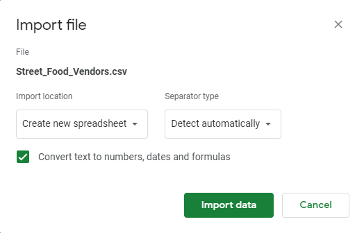

**November 29, 2021**<br>
**MPAD-2003, Introduction to Data Storytelling**<br>
**Stefan Warwick**<br>
**Presented to Jean-Sébastien Marier**<br>

# Project 2: Basic Data Analysis & Visualization

Use one hashtag symbol (`#`) to create a level 1 heading like this one.

## Foreword

I have been assigning different versions of this project to my digital journalism and data storytelling students for a few years now. Its structure was inspired by the main sections/chapters of [*The Data Journalism Handbook*](https://datajournalism.com/read/handbook/one/). This version was further inspired by the [Key Capabilities in Data Science](https://extendedlearning.ubc.ca/programs/key-capabilities-data-science) program offered by the University of British Columbia (UBC).

**Here are some useful resources for this assignment:**

* [GitHub's *Basic writing and formatting syntax* page](https://docs.github.com/en/github/writing-on-github/getting-started-with-writing-and-formatting-on-github/basic-writing-and-formatting-syntax)
* [GitHub Guides: Mastering Markdown](https://guides.github.com/features/mastering-markdown/)
* [The template repository for this assignment in case you delete something by mistake](https://github.com/jsmarier/Template-for-the-Basic-Data-Analysis-Visualization-Project)

Did you notice how to create a hyperlink? In Markdown, we put the clickable text between square brackets and the actual URL between parentheses.

And to create an unordered list, we simply put a star (`*`) before each item.

## Introduction

  This assignment asks us to clean and interpret a dataset larger than we have previously used. We also must create a visualization with the data. The dataset was sourced from the City of Ottawa’s open data portal, and provided to us from our professor. The data is collected based on the issuance of building permits. The main sections of this assignment will show me getting the data and importing it into Google Sheets, including observations about the data that I made, how I cleaned and analyzed the data, and what functions I used to do this, and how I delivered the data through making charts in Datawrapper. Here is a link to the data set from City of Ottawa’s website: [City of Ottawa Open Data Portal](https://open.ottawa.ca/documents/ottawa::construction-demolition-and-pool-enclosure-permits-monthly-2020/about)

## Getting Data

  I imported my data into google sheets by just making a copy of the google sheets file provided to us.
This dataset was created by the City of Ottawa throughout the year of 2020. It was published on February 11th, 2020. It includes information about the type of permit it is, as they are either construction, demolition, or a pool closure. It includes who the contractor is (unless the contractor is also the property owner), the street address, the value of the work being completed, the municipality it is in, the ward, and the date of issuance. It is a very large file, and at least for my purposes had rows of data that I was not interested in, for example I did not care very much what each individual building permit number is. 
  The dataset was last updated on February 13th, 2021. 
  In this dataset, there are 12 549 rows and 16 columns. 
  Columns A-C have the details of the property’s address, A having the street number of the property, B having the street name, and C having it’s postal code where there is one. Column D has the information of what ward number the property is located in. Column E has the title “Plan”, and I believe this is the way that the City stores the information about what set of plans relates to which permit. If someone submits a floor plan, or a diagram of a roof truss system, the city has to store it which I think is where the number serves as its identifier. Not all permits need this, so maybe that is what 4M means in that column. I could not find any information about this online. Column F says what Lot number the permit is for. Column G says what contractor is being used for the work. Column H has the information about what type of building it is. Column I has the municipality. J has a description of the type of work being completed. K is D.U., which in construction means Dwelling Unit, so it may be showing how many more Dwelling Units will be created by the construction. L is the value of the work being done. M is the square footage of the project. N is the permit number, allowing the city to keep track of what work has what permit. O shows whether the permit is for construction, demolition, or pool closure. P has the date that the permit was issued. All of the variables are nominal except for columns L and M, which are discrete, and P, which is an ordinal variable.
  I first noticed that there were quite a few empty cells, mostly in the columns of Postal Code, Plan, Lot, and D.U. The values column was formatted kind of weirdly, for some reason when you would try to order them it would restart at 0 multiple times through the dataset, meaning there were white spaces or other things to worry about in some cells. All of the dates were also in French, for example using “Janv.” for Janvier instead of January. In general the sheet was not in too bad of shape, but definitely needed to be cleaned.


## Understanding Data

  I did not use OpenRefine to clean my data, because I felt it would be simpler and not too much effort to clean it just using Google Sheets. If the data had been less clean, and I needed to do more intensive cleaning I would have used OpenRefine. I used the google sheets built in function to get rid of white spaces, specifically in the Value column. I also completely deleted some columns because I did not need them, like the Plan, Lot, Description, D.U., FT²,and  Issued Date. This just made it a lot easier for my computer to deal with the data, and now I realize it is not in good practice to delete data, it was not incredibly important to what I am looking at specifically so it seemed like a good way to be more focused on other aspects at the time.I started using find and replace so that I could convert the dates to English, by searching for “janv” and replacing with “01”, but about halfway through I realized I did not really need to analyze the dates anyways. I also froze the first row. I concatenated the Address columns because they were not very important elements on their own since I was going to analyze their location based on their municipality. I did this partly because not all properties had their Postal Code listed. I also got rid of any building permits worth less than 1 000 000 because I wanted to focus more on permits that would vastly change the area, mostly new or very important buildings, not just small renovations to houses. I was focused mostly on the very important properties.  
  I used the function to calculate the mean that is called average in Sheets for my pivot table about the average permit value for each municipality's average permit value. I also used “MAX” in the same table to find the highest value permit for each area. My other pivot table that tracks only the total amount of the values of all the building permits for each area uses “SUM”. This is the pivot table I used to make an exploratory Google Sheets chart. I also made a section where I took the median from each of the values for each municipality.
  Considering how low the average building permit was for Old Ottawa, I was a little bit surprised how much money in total is being invested there. One annoying piece of the data is that Vanier has 115 entries in the original table, but when you take out the permits valued less than $1 000 000 it leaves only one entry. This entry is much more expensive than the average value for the other municipalities, but due to there only being one entry its average is $8.9 million in contrast to the others which are mostly less than $2 million, with the second closest still around $3 million less. This is why I chose to include the MAX value of each building permit in the same table, so that the viewer doesn’t think Vanier is being incredibly heavily invested in. The main story here is that Old Ottawa is the most heavily invested in, followed by Nepean. Nepean has the higher maximum value permit though, at $204 million, so there is definitely strong competition for Old Ottawa, but the median values show that Nepean still has a lot of catching up to do. The median value of a building permit is around half a million more in Old Ottawa compared to Nepean.
[Link to Cleaned Data Sheet](https://docs.google.com/spreadsheets/d/1ol8iA2AkRKJg9T2GYaFRXPWNBAMExtsuuPwS-oTXLKU/edit?usp=sharing)


<br>
*Figure 1: The "Import file" prompt on Google Sheets.*

**Here are examples of functions and lines of code put in grey boxes:**

1. If you name a function, put it between "angled" quotation marks like this: `IMPORTHTML`.
1. If you want to include the entire line of code, do the same thing, albeit with your entire code: `=IMPORTHTML("https://en.wikipedia.org/wiki/China"; "table", 5)`.
1. Alternatively, you can put your code in an independent box using the template below:

``` r
=IMPORTHTML("https://en.wikipedia.org/wiki/China"; "table", 5)
```
This also shows how to create an ordered list. Simply put `1.` before each item.

## Delivering Data

  I prepared my data for visualization by creating my pivot tables and using them for the source of my DataWrapper charts. I decided to do this by downloading my data as CSV files.
  First I downloaded my data as CSV files for each visualization. I then brought it into DataWrapper, at which point I created a column chart and a bar chart. I realized that in my chart about the average building permit value for each municipality, due to the Vanier seeming so much more heavily invested in than it really is, I needed to find a way for the data to be more truthful (INSERT QUOTE FROM TEXTBOOK ABOUT TRUTH). I decided to go back to my Google Sheet and add another column for the maximum value of the permits.  Once I did this I brought it back into datawrapper. From there I changed the chart to be a bullet bar chart, to show both values but not necessarily compare the two values directly to each other. Since the values are so different from each other, a grouped column chart did not look good enough to show the lower values. After this I changed the colours to be very different from each other so they stood out, and so colourblind people could still see the differences. I then filled out all of the information like the description and the link to the original data.


## Conclusion

  The main findings of my two charts is that Old Ottawa and Nepean are the most invested in areas of Ottawa. It shows that the lowest invested in areas are Vanier and West Carleton. With the kind of values the maximum permit value section of the chart shows, it is evident that there are enough people in those areas to justify investing that kind of money there. Further analysis could find a lack of affordable housing being built in these areas, leading to issues with this problem that plague places like Vancouver and New York City. It is important that if Ottawa wants to grow to be a big city like them, it has the time now to make sure money is being invested in the right places to ensure stable growth, and lack of problems with housing being too expensive.

**This section should include a screen capture of your chart and its public link, like so:**

<br>
*Figure 2: The map created with Datawrapper*
[Average Building Permit Value by Municipality](https://datawrapper.dwcdn.net/MisHI/4/)

## 6. References

Include a list of your references here.
